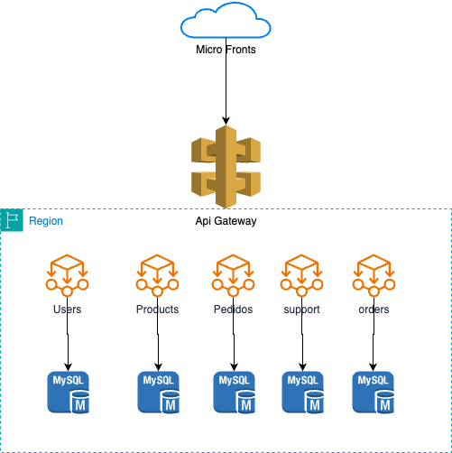

# ironhack-microservices-architecture

### Objectives:
Design a microservices architecture based on a given set of requirements.
Simulate the decomposition of a monolithic architecture into microservices.
Reflect on the design decisions and discuss alternative approaches.

### Tasks:
Design Exercise:

### Application Brief: 
Participants are given a description of a monolithic e-commerce application handling user management, product catalog, order processing, and customer support.

### Task: 
Identify and outline potential microservices based on domain-driven design principles. Participants will determine service boundaries, define how services will communicate, and plan how to handle shared data.

### Monolithic E-Commerce Application Description:
The application is a traditional e-commerce platform that encompasses all functionalities within a single, unified software architecture. The application handles the following key operations:

### User Management: 
Manages user profiles, authentication, and authorization. It stores personal information, manages login sessions, and handles user preferences.

### Product Catalog: 
Maintains a comprehensive list of products, including descriptions, pricing, images, and inventory levels. It supports product search and categorization functionalities.

### Order Processing: 
Manages all aspects of the ordering process, from cart management to order placement, payment processing, and order history tracking.

### Customer Support: 
Handles customer inquiries, returns, complaints, and feedback through a ticket-based system integrated with the user and order databases.

The application is built on a single relational database that holds all user data, product information, orders, and customer support interactions. It currently operates on a single code base with a web-based frontend that communicates directly with the backend server.

The platform has been experiencing challenges with scaling during high-traffic periods, frequent downtimes during updates, and increasing difficulty in implementing new features without affecting existing functionalities. The goal is to decompose this monolithic architecture into a microservices-based architecture to address these issues and improve overall agility and scalability.

### Implementation Simulation:
Migration Roadmap: Develop a detailed plan for migrating the identified monolithic components to microservices. This plan should include prioritization of services to be migrated, identification of dependencies, and a strategy for data migration.
Architecture Documentation: Document the proposed microservices architecture, illustrating the interaction between services and the migration steps. Include a brief narrative explaining the rationale behind key decisions.

# Solucion

- Diseño de la Arquitectura de Microservicios
    -   Identificación de Microservicios:
        -   Basado en la descripción de la aplicación monolítica, podemos identificar los siguientes microservicios potenciales:
-   Servicio de Gestión de Usuarios
-   Servicio de Catálogo de Productos
-   Servicio de Procesamiento de Pedidos
-   Servicio de Soporte al Cliente

## Responsabilidades de los microservicios:

### Gestión de Usuarios

-   Responsabilidades 
    -   Manejar perfiles de usuarios, autenticación, autorización, preferencias de usuario y gestión de sesiones.
-   Base de Datos 
    -   Base de datos de usuarios que contiene información personal, credenciales y preferencias.

### Catálogo de Productos

-   Responsabilidades
    -   Gestionar listas de productos, descripciones, precios, imágenes, niveles de inventario, búsqueda y categorización.
-   Base de Datos 
    -   Base de datos de productos que contiene detalles de productos y niveles de inventario.

### Procesamiento de Pedidos

-   Responsabilidades 
    -   Manejar gestión de carritos, realización de pedidos, procesamiento de pagos y seguimiento del historial de pedidos.
-   Base de Datos 
    -   Base de datos de pedidos que contiene artículos del carrito, pedidos, detalles de pago e historial de pedidos.

### Soporte al Cliente

-   Responsabilidades
    -   Gestionar consultas de clientes, devoluciones, quejas y comentarios a través de un sistema de tickets.
-   Base de Datos
    -   Base de datos de soporte que contiene tickets, interacciones de usuarios e historial de soporte.

### Comunicación entre Servicios

-   Comunicación sincrónica utilizando APIs REST para operaciones en tiempo real.
-   Comunicación asincrónica, no se identifica la necesidad de establecer un canal asincrono

# Plan de migracion

## Evaluación y Planificación

    -   Analizar la aplicación monolítica existente para entender dependencias y flujos de datos.
    -   Identificar funcionalidades clave y priorizar servicios basados en necesidades comerciales y complejidad.

## Extracción del Servicio de Gestión de Usuarios:

-   Crear una nueva base de datos de usuarios.
    -   Previo a la implementacion del microservicio realizaremos una migracion de los usuarios a la nueva BD
-   Implementar el microservicio de gestión de usuarios.
    -   Con ayuda de un front envedido en la aplicacion monolitica apuntaremos las peticiones al nuevo microservicio
-   Actualizar el frontend para comunicarse con el nuevo servicio de gestión de usuarios.

## Extracción del Servicio de Catálogo de Productos:

-   Crear una nueva base de datos de productos.
    -   Migracion del catalogo de productos
-   Implementar el microservicio de catálogo de productos.
    -   Con ayuda de un front envedido en la aplicacion monolitica apuntaremos las peticiones al nuevo microservicio
-   Actualizar el frontend para comunicarse con el nuevo servicio de catálogo de productos.

## Crear una nueva base de datos de pedidos.
-   Implementar el microservicio de procesamiento de pedidos.
-   Actualizar el frontend para comunicarse con el nuevo servicio de procesamiento de pedidos.
    -   Con ayuda de un front envedido en la aplicacion monolitica apuntaremos las peticiones al nuevo microservicio
Migrar los datos relacionados con pedidos a la nueva base de datos.

## Extracción del Servicio de Soporte al Cliente:
-   Crear una nueva base de datos de soporte.
-   Implementar el microservicio de soporte al cliente.
-   Actualizar el frontend para comunicarse con el nuevo servicio de soporte al cliente.
-   Migrar los datos relacionados con soporte a la nueva base de datos.
-   Implementación de Comunicación Inter-Servicios:

## Pruebas y Optimización:

-   Realizar pruebas exhaustivas para cada microservicio y para el sistema en general.
-   Optimizar el rendimiento y la escalabilidad basándose en los resultados de las pruebas.
-   Monitorizar y registrar el rendimiento de los servicios para una optimización continua.

## Reflexión
-   Desafíos
    -   Asegurar el funcionamiento de la aplicacion en cada uno de sus modulos, durante la migracion progresiva hacia microservicios
    -   Diseñar un mecanismo que nos permita cambiar entre funcionalidades, es decir que nos permita regresar al uso de la aplicacion monolitica en caso de que los microservicios fallen en la implementacion

-   Beneficios
    -   La arquitectura de microservicios mejora la escalabilidad, flexibilidad y mantenibilidad.

# Diagrama de arquitectura

